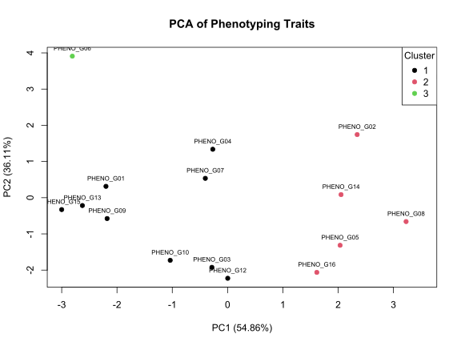

# Plant Phenotyping Data Workflow in R


A reproducible R workflow for cleaning and interpreting plant phenotyping trait data in a crop-improvement context.

This repository demonstrates how raw genotype-level phenotyping observations can be checked, cleaned, summarized, and converted into useful trait-pattern outputs. The dataset is synthetic and intended only for portfolio demonstration.

## Why this repository exists

Postdoctoral roles in plant phenotyping, crop improvement, and data-supported breeding often require a researcher to connect field observations with interpretable statistics. This repository shows a practical workflow for:

- checking raw phenotyping data
- handling missing/noisy values transparently
- summarizing genotype performance
- studying trait associations
- running PCA for trait-pattern interpretation
- grouping genotypes by phenotype similarity
- exporting figures and decision-support tables

## Repository structure

```text
plant-phenotyping-data-workflow-r/
├── data/
│   └── phenotyping_trait_sample.csv
├── docs/
│   └── methods_note.md
├── outputs/
│   ├── cleaned_phenotyping_data.csv
│   ├── correlation_matrix.csv
│   ├── data_quality_report.md
│   ├── genotype_cluster_summary.csv
│   ├── genotype_means.csv
│   ├── phenotype_grouping_report.md
│   ├── pca_loadings.csv
│   ├── pca_scores.csv
│   ├── pca_variance_explained.csv
│   ├── ranked_phenotypes.csv
│   ├── correlation_heatmap.svg
│   ├── dendrogram.svg
│   ├── pca_biplot.svg
│   └── phenotype_group_profile.svg
├── reports/
│   └── phenotyping_workflow_report.Rmd
├── scripts/
│   └── analyze_phenotyping_traits.R
├── LICENSE
└── README.md
```

## Workflow overview

1. Import synthetic phenotyping observations.
2. Check required columns and missing values.
3. Impute missing numeric observations using trait medians.
4. Summarize trait means at genotype level.
5. Estimate trait correlations.
6. Run PCA on scaled genotype means.
7. Cluster genotypes using hierarchical clustering.
8. Create phenotype groups using a transparent selection-support index.
9. Export CSV tables, Markdown reports, and SVG figures.

## Traits included

- plant height
- canopy width
- leaf area index
- SPAD chlorophyll index
- NDVI proxy
- days to maturity
- marketable yield
- disease score
- plant vigor score

## How to run

From R or RStudio:

```r
source("scripts/analyze_phenotyping_traits.R")
```

The script uses base R only. No package installation is required.

## Example result

The synthetic workflow groups genotypes into phenotype clusters and creates outputs such as:

- correlation heatmap
- PCA biplot
- genotype dendrogram
- cluster trait-profile plot
- ranked phenotype table



## Important limitation

This is a demonstration workflow using synthetic data. It should be interpreted as evidence of reproducible data organization, trait analysis, and research-code communication — not as evidence of a real variety recommendation.

See [docs/methods_note.md](docs/methods_note.md) for assumptions and limitations.

## Author

Mokkala Siva Prasad  
Vegetable Science | Plant Breeding | Field Phenotyping | Statistical Analysis  
GitHub: https://github.com/Siva-ghub5123
